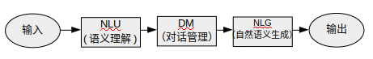

### introduction
任务驱动聊天框架。
将聊天细分为多个任务，不同的任务使用不同的对话逻辑，建立以完成某个具体任务为目标的会话场景。

 

### word&char embedding

使用两种 embedding

* word level embedding
	* 词级别emedding，使用腾讯开源词向量：https://ai.tencent.com/ailab/nlp/embedding.html
	* 基于jieba、词向量的最长匹配分词方法
* charactor level embedding
	* 字级别embedding，使用bert开源中文模型： https://storage.googleapis.com/bert_models/2018_11_03/chinese_L-12_H-768_A-12.zip
	* 参考bert tokenization方法，增加全角、半角转换

### 支持的多轮交互对话任务

weather，phone，yes，no，chat

### DM(dialog management)
基于slot filling的对话管理系统

### 基本环境

* python 3.6
* tensorflow=1.4
* jieba=0.39
* pymongo
* numpy
* dash==0.35.1 
* dash-html-components==0.13.4 
* dash-core-components==0.42.1  
* dash-table==3.1.11
* gunicorn==19.9.0
