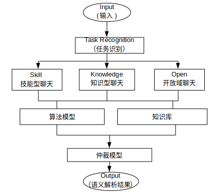

## introduction
任务驱动型聊天框架。 
将聊天细分为多个任务，不同的任务使用不同的对话逻辑，建立以完成某个具体任务为目标的会话场景。 

 

主要结构简介

* 输入: 文本
* NLU: 自然语义理解。理解输入文本所属领域、用户意图、提取关键信息等
* DM: 对话管理。管理对话逻辑，实现不同场景下的会话管理
* NLG: 自然语义生成。确定每轮会话后的执行动作
* 输出: 文本（与用户交互）或动作（如打电话，开灯等）

## NLU（Natural Language Understanding）
自然语义理解模块。 
这个模块的任务有:

* 解析输入文本所属的对话任务类型
* 解析输入文本所包含的用户意图
* 解析执行用户意图所必须的信息（关键词）

输入文本所包含的对话任务信息、意图信息、关键词信息是DM模块的输入。

 

部分训练模型: 
[模型1](https://github.com/wj573510848/transformer-se2seq-models) 
[模型2](https://github.com/wj573510848/rnn-models-bert-models) 

## DM(dialog management)
基于slot filling的对话管理系统。 
slot:完成一轮对话所需的必要信息，如打电话需要号码，查询知识点需要关键词等。 
围绕完成某类任务需要的信息与用户进行交互。 

 

该模块主要任务有：
* 账户管理（TODO:登录/验证）
* 对话行为管理
* 主对话逻辑管理
* 次级对话逻辑管理

## NLG(Natural Language Generation)
自然语言生成。 
DM的每一个阶段都会输出一个对话的状态，需要在这个状态的基础上与用户进行交互。 

分为三种:
* answer: 输出文字与用户交互
* action: 执行某个具体的操作
* answer & action: 执行某个具体的操作并且与用户交互

## word&char embedding

使用两种 embedding

* word level embedding
	* 词级别emedding，使用腾讯开源词向量：https://ai.tencent.com/ailab/nlp/embedding.html
	* 基于jieba、词向量的最长匹配分词方法
* charactor level embedding
	* 字级别embedding，使用bert开源中文模型： https://storage.googleapis.com/bert_models/2018_11_03/chinese_L-12_H-768_A-12.zip
	* 参考bert tokenization方法，增加全角、半角转换

## 基本环境

* python 3.6
* tensorflow=1.4
* jieba=0.39
* pymongo
* numpy
* dash==0.35.1 
* dash-html-components==0.13.4 
* dash-core-components==0.42.1  
* dash-table==3.1.11
* gunicorn==19.9.0

## TODO
* 账号系统
* web系统
* 并发能力
