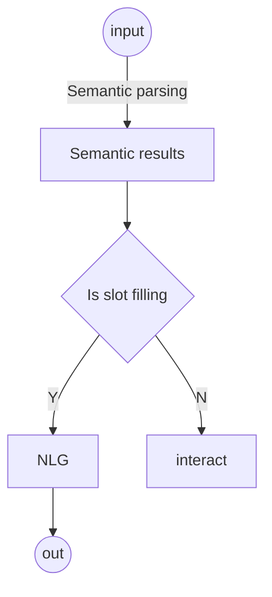

DM逻辑
https://www.jianshu.com/p/b421cc723da5
https://www.cnblogs.com/Cherry-Linux/p/7797795.html

```mermaid
graph TD
输入((input))
输出((out))
语义结果[Semantic results]
输入--Semantic parsing-->语义结果
s{Is slot filling}
语义结果-->s
s--Y-->NLG
s--N-->interact
NLG-->输出
```